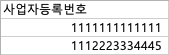

# 국세청 API를 이용한 사업자 상태 조회
[공공데이터포털 국세청 API 공식 메뉴얼](https://www.data.go.kr/data/15081808/openapi.do)

## Python 설치
최신버전의 Python은 [정식 사이트](https://www.python.org/downloads/)에서 다운로드 후 설치해주세요

## 국세청 API 서비스 키 발급
프로그램에 입력할 서비스 키는 [공공데이터포털](https://www.data.go.kr/data/15081808/openapi.do)에서 "활용신청"을 클릭해 받아주세요

## 사업자등록번호 엑셀 준비
프로그램에서 읽을 엑셀 파일은 이렇게 준비해 주세요:
1. 사업자등록번호를 입력할 열 첫번째 행에 "사업자등록번호" 입력
2. 그 다음 열부터 숫자로 된 사업자등록번호 입력 ("-" 제외)

예시: 
 
(사진에 있는 사업자등록번호는 국세청에 등록되지 않은 사업자등록번호입니다)

## 프로그램 사용 방법
### 1. 서비스 키 저장
1. [공공데이터포털](https://www.data.go.kr/) 로그인 후 [마이페이지](https://www.data.go.kr/iim/api/selectDevAcountList.do)에서 승인된 "국세청_사업자등록정보 진위확인 및 상태조회 서비스" 페이지 접속
2. 일반인증키 (Encoding) 전체 복사
3. 서비스 키 입력란에 붙여넣은 뒤 "서비스키 저장" 버튼 누르기

### 2. 사업자등록번호 엑셀 선택
1. "엑셀 불러오기" 버튼 클릭 후 엑셀 파일을 선택
2. 성공적으로 불러오면 버튼 옆 검은색 상자에 엑셀 파일 위치가 나타납니다

### 3. 저장할 폴더 지정
1. "저장 폴더 선택" 버튼 클릭 후 출력된 엑셀 파일을 저장하고 싶은 폴더를 선택
2. 폴더가 성공적으로 지정되면 버튼 옆 검은색 상자에 엑셀 파일 위치가 나타납니다

### 4. 사업자 상태 조회
1. 서비스 키, 사업자등록번호 엑셀, 저장 위치 입력 후 "사업자 상태 조회" 클릭
2. 지정한 저장 폴더에서 "사업자상태.xlsx" 열기

출력 예시: 
